# Run 4  
- loss = 'categorical\_crossentropy'  
- optimizer = 'adam'  
- batch\_size = 128  
- epochs = 1000  
- earlystop = EarlyStopping(monitor='val\_acc',min\_delta=.01, patience=20)  

#### Summary Results 
<table border="1" class="dataframe">  <thead>    <tr style="text-align: right;">      <th></th>      <th>epochs</th>      <th>time</th>      <th>trainacc</th>      <th>valacc</th>    </tr>    <tr>      <th>model</th>      <th></th>      <th></th>      <th></th>      <th></th>    </tr>  </thead>  <tbody>    <tr>      <th>model1</th>      <td>133</td>      <td>3m:3s</td>      <td>0.661846</td>      <td>0.778986</td>    </tr>    <tr>      <th>model2</th>      <td>120</td>      <td>1m:28s</td>      <td>0.592928</td>      <td>0.750000</td>    </tr>    <tr>      <th>model3</th>      <td>139</td>      <td>1m:15s</td>      <td>0.710761</td>      <td>0.809179</td>    </tr>    <tr>      <th>model4</th>      <td>113</td>      <td>2m:46s</td>      <td>0.743088</td>      <td>0.826087</td>    </tr>  </tbody></table>  

## Model1  

#### Architecture 
- Conv2D 64 (2, 2) (1, 1) relu  
- Flatten
- Dense 100 relu  
- Dense 26 softmax  

#### Training Plot 
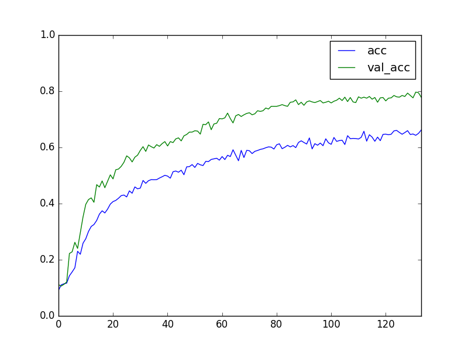  

#### Layer 1 Weights (Conv) - Sample Images 
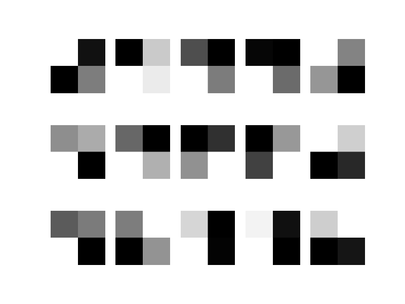  

#### Layer 3 Weights (Dense) - Sample Images 
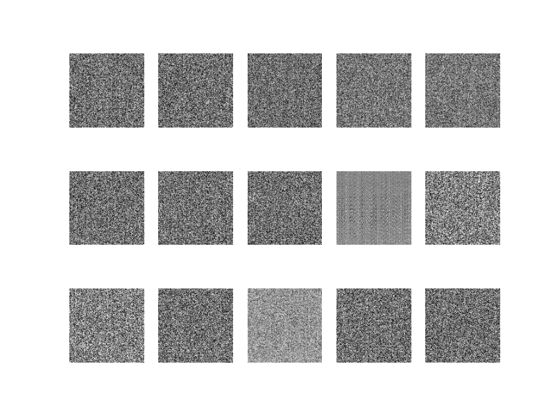  

#### Layer 4 Weights (Dense) - Sample Images 
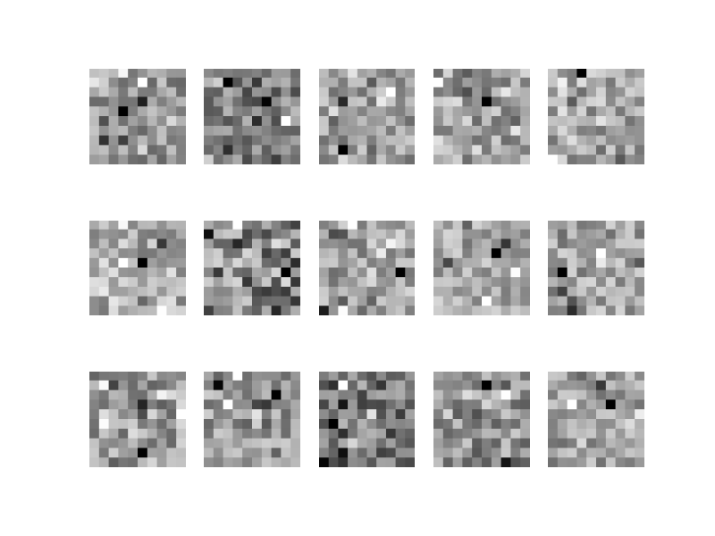  

#### Letter Accuracy 
<table border="1" class="dataframe">  <thead>    <tr style="text-align: right;">      <th></th>      <th>TrainCount</th>      <th>TrainCorrect</th>      <th>Train%Correct</th>      <th>ValCount</th>      <th>ValCorrect</th>      <th>Val%Correct</th>    </tr>    <tr>      <th>0</th>      <th></th>      <th></th>      <th></th>      <th></th>      <th></th>      <th></th>    </tr>  </thead>  <tbody>    <tr>      <th>A</th>      <td>275</td>      <td>252</td>      <td>0.92</td>      <td>92</td>      <td>83</td>      <td>0.90</td>    </tr>    <tr>      <th>B</th>      <td>54</td>      <td>29</td>      <td>0.54</td>      <td>18</td>      <td>9</td>      <td>0.50</td>    </tr>    <tr>      <th>C</th>      <td>102</td>      <td>80</td>      <td>0.78</td>      <td>34</td>      <td>21</td>      <td>0.62</td>    </tr>    <tr>      <th>D</th>      <td>99</td>      <td>88</td>      <td>0.89</td>      <td>33</td>      <td>26</td>      <td>0.79</td>    </tr>    <tr>      <th>E</th>      <td>214</td>      <td>192</td>      <td>0.90</td>      <td>71</td>      <td>60</td>      <td>0.85</td>    </tr>    <tr>      <th>F</th>      <td>41</td>      <td>26</td>      <td>0.63</td>      <td>14</td>      <td>7</td>      <td>0.50</td>    </tr>    <tr>      <th>G</th>      <td>66</td>      <td>46</td>      <td>0.70</td>      <td>22</td>      <td>12</td>      <td>0.55</td>    </tr>    <tr>      <th>H</th>      <td>91</td>      <td>67</td>      <td>0.74</td>      <td>30</td>      <td>20</td>      <td>0.67</td>    </tr>    <tr>      <th>I</th>      <td>162</td>      <td>144</td>      <td>0.89</td>      <td>54</td>      <td>46</td>      <td>0.85</td>    </tr>    <tr>      <th>J</th>      <td>31</td>      <td>19</td>      <td>0.61</td>      <td>10</td>      <td>3</td>      <td>0.30</td>    </tr>    <tr>      <th>K</th>      <td>40</td>      <td>28</td>      <td>0.70</td>      <td>13</td>      <td>9</td>      <td>0.69</td>    </tr>    <tr>      <th>L</th>      <td>100</td>      <td>90</td>      <td>0.90</td>      <td>34</td>      <td>28</td>      <td>0.82</td>    </tr>    <tr>      <th>M</th>      <td>76</td>      <td>48</td>      <td>0.63</td>      <td>25</td>      <td>18</td>      <td>0.72</td>    </tr>    <tr>      <th>N</th>      <td>167</td>      <td>152</td>      <td>0.91</td>      <td>56</td>      <td>48</td>      <td>0.86</td>    </tr>    <tr>      <th>O</th>      <td>174</td>      <td>156</td>      <td>0.90</td>      <td>58</td>      <td>53</td>      <td>0.91</td>    </tr>    <tr>      <th>P</th>      <td>78</td>      <td>61</td>      <td>0.78</td>      <td>26</td>      <td>16</td>      <td>0.62</td>    </tr>    <tr>      <th>Q</th>      <td>12</td>      <td>0</td>      <td>0.00</td>      <td>4</td>      <td>0</td>      <td>0.00</td>    </tr>    <tr>      <th>R</th>      <td>185</td>      <td>162</td>      <td>0.88</td>      <td>62</td>      <td>51</td>      <td>0.82</td>    </tr>    <tr>      <th>S</th>      <td>162</td>      <td>146</td>      <td>0.90</td>      <td>54</td>      <td>47</td>      <td>0.87</td>    </tr>    <tr>      <th>T</th>      <td>154</td>      <td>142</td>      <td>0.92</td>      <td>51</td>      <td>44</td>      <td>0.86</td>    </tr>    <tr>      <th>U</th>      <td>49</td>      <td>41</td>      <td>0.84</td>      <td>17</td>      <td>13</td>      <td>0.76</td>    </tr>    <tr>      <th>V</th>      <td>38</td>      <td>29</td>      <td>0.76</td>      <td>13</td>      <td>8</td>      <td>0.62</td>    </tr>    <tr>      <th>W</th>      <td>34</td>      <td>25</td>      <td>0.74</td>      <td>11</td>      <td>7</td>      <td>0.64</td>    </tr>    <tr>      <th>X</th>      <td>25</td>      <td>17</td>      <td>0.68</td>      <td>9</td>      <td>8</td>      <td>0.89</td>    </tr>    <tr>      <th>Y</th>      <td>32</td>      <td>23</td>      <td>0.72</td>      <td>11</td>      <td>7</td>      <td>0.64</td>    </tr>    <tr>      <th>Z</th>      <td>18</td>      <td>3</td>      <td>0.17</td>      <td>6</td>      <td>1</td>      <td>0.17</td>    </tr>  </tbody></table>  

#### Accurate Validation Prediction - Sample Images 
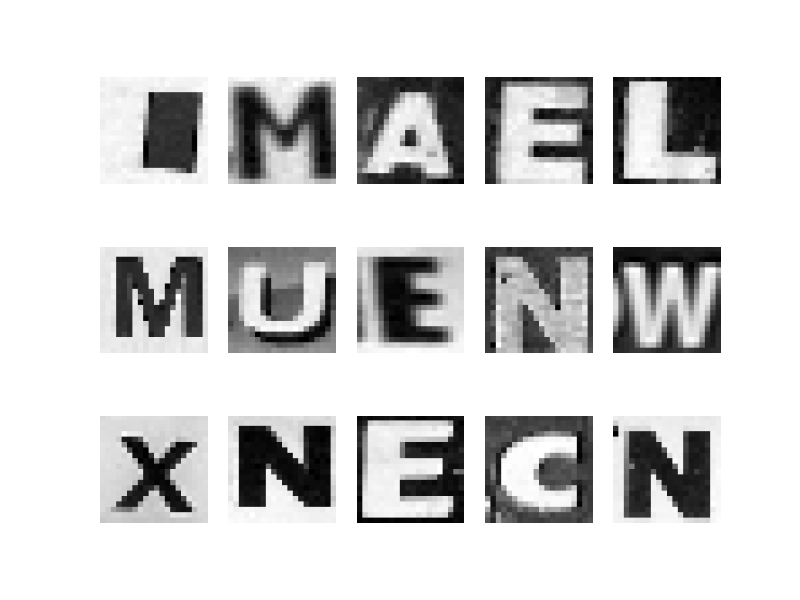  

#### Inaccurate Validation Prediction - Sample Images 
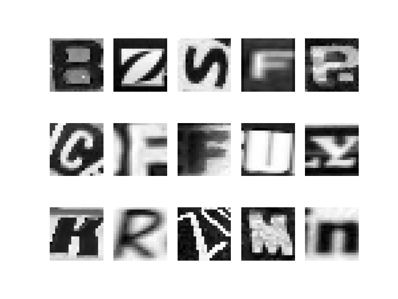  

## Model2  

#### Architecture 
- Conv2D 64 (2, 2) (1, 1) relu  
- MaxPooling2D (2, 2) (2, 2)  
- Flatten
- Dense 100 relu  
- Dense 26 softmax  

#### Training Plot 
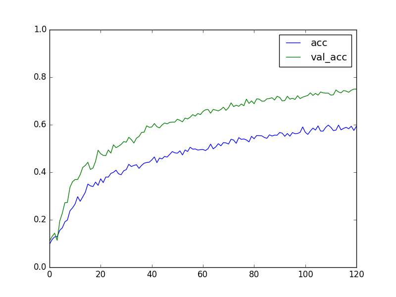  

#### Layer 1 Weights (Conv) - Sample Images 
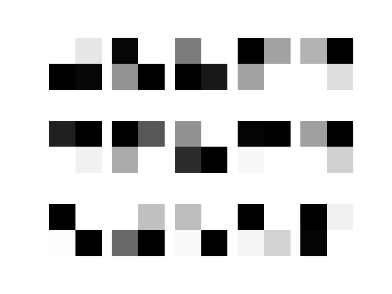  

#### Layer 4 Weights (Dense) - Sample Images 
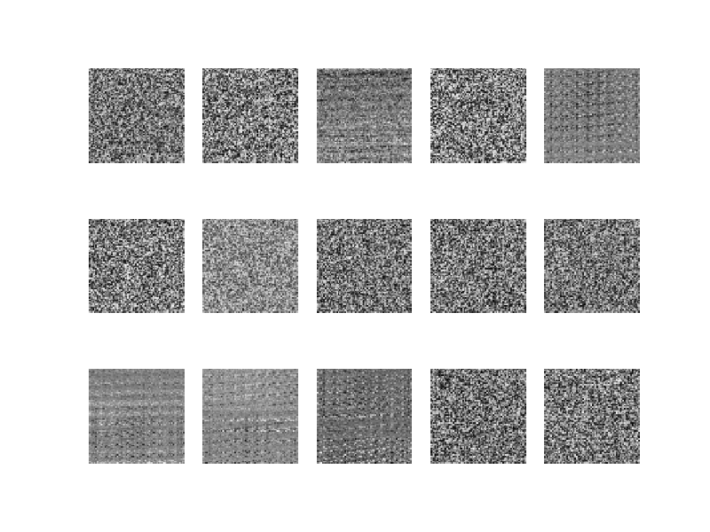  

#### Layer 5 Weights (Dense) - Sample Images 
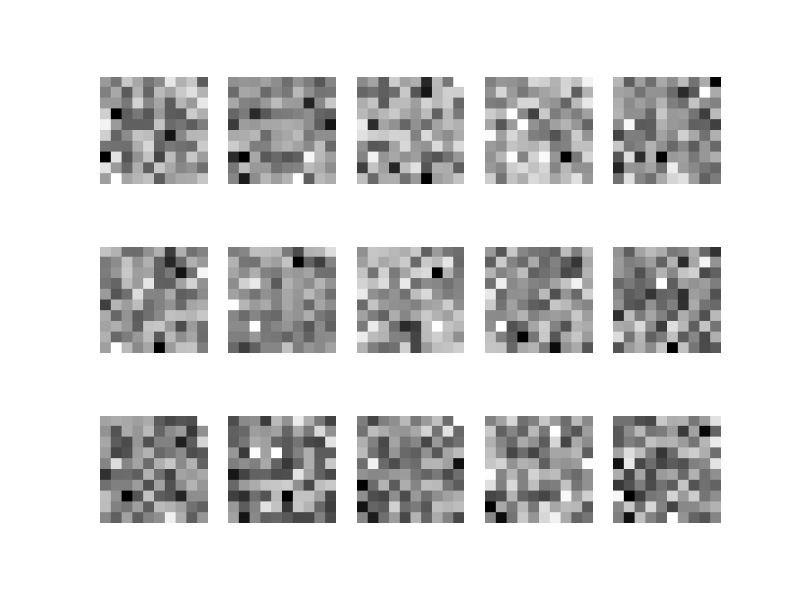  

#### Letter Accuracy 
<table border="1" class="dataframe">  <thead>    <tr style="text-align: right;">      <th></th>      <th>TrainCount</th>      <th>TrainCorrect</th>      <th>Train%Correct</th>      <th>ValCount</th>      <th>ValCorrect</th>      <th>Val%Correct</th>    </tr>    <tr>      <th>0</th>      <th></th>      <th></th>      <th></th>      <th></th>      <th></th>      <th></th>    </tr>  </thead>  <tbody>    <tr>      <th>A</th>      <td>275</td>      <td>250</td>      <td>0.91</td>      <td>92</td>      <td>83</td>      <td>0.90</td>    </tr>    <tr>      <th>B</th>      <td>54</td>      <td>9</td>      <td>0.17</td>      <td>18</td>      <td>3</td>      <td>0.17</td>    </tr>    <tr>      <th>C</th>      <td>102</td>      <td>64</td>      <td>0.63</td>      <td>34</td>      <td>22</td>      <td>0.65</td>    </tr>    <tr>      <th>D</th>      <td>99</td>      <td>77</td>      <td>0.78</td>      <td>33</td>      <td>24</td>      <td>0.73</td>    </tr>    <tr>      <th>E</th>      <td>214</td>      <td>191</td>      <td>0.89</td>      <td>71</td>      <td>60</td>      <td>0.85</td>    </tr>    <tr>      <th>F</th>      <td>41</td>      <td>28</td>      <td>0.68</td>      <td>14</td>      <td>8</td>      <td>0.57</td>    </tr>    <tr>      <th>G</th>      <td>66</td>      <td>43</td>      <td>0.65</td>      <td>22</td>      <td>13</td>      <td>0.59</td>    </tr>    <tr>      <th>H</th>      <td>91</td>      <td>59</td>      <td>0.65</td>      <td>30</td>      <td>17</td>      <td>0.57</td>    </tr>    <tr>      <th>I</th>      <td>162</td>      <td>130</td>      <td>0.80</td>      <td>54</td>      <td>45</td>      <td>0.83</td>    </tr>    <tr>      <th>J</th>      <td>31</td>      <td>9</td>      <td>0.29</td>      <td>10</td>      <td>0</td>      <td>0.00</td>    </tr>    <tr>      <th>K</th>      <td>40</td>      <td>23</td>      <td>0.57</td>      <td>13</td>      <td>4</td>      <td>0.31</td>    </tr>    <tr>      <th>L</th>      <td>100</td>      <td>88</td>      <td>0.88</td>      <td>34</td>      <td>28</td>      <td>0.82</td>    </tr>    <tr>      <th>M</th>      <td>76</td>      <td>55</td>      <td>0.72</td>      <td>25</td>      <td>19</td>      <td>0.76</td>    </tr>    <tr>      <th>N</th>      <td>167</td>      <td>147</td>      <td>0.88</td>      <td>56</td>      <td>47</td>      <td>0.84</td>    </tr>    <tr>      <th>O</th>      <td>174</td>      <td>156</td>      <td>0.90</td>      <td>58</td>      <td>55</td>      <td>0.95</td>    </tr>    <tr>      <th>P</th>      <td>78</td>      <td>50</td>      <td>0.64</td>      <td>26</td>      <td>11</td>      <td>0.42</td>    </tr>    <tr>      <th>Q</th>      <td>12</td>      <td>1</td>      <td>0.08</td>      <td>4</td>      <td>0</td>      <td>0.00</td>    </tr>    <tr>      <th>R</th>      <td>185</td>      <td>163</td>      <td>0.88</td>      <td>62</td>      <td>55</td>      <td>0.89</td>    </tr>    <tr>      <th>S</th>      <td>162</td>      <td>135</td>      <td>0.83</td>      <td>54</td>      <td>46</td>      <td>0.85</td>    </tr>    <tr>      <th>T</th>      <td>154</td>      <td>144</td>      <td>0.94</td>      <td>51</td>      <td>45</td>      <td>0.88</td>    </tr>    <tr>      <th>U</th>      <td>49</td>      <td>31</td>      <td>0.63</td>      <td>17</td>      <td>9</td>      <td>0.53</td>    </tr>    <tr>      <th>V</th>      <td>38</td>      <td>26</td>      <td>0.68</td>      <td>13</td>      <td>5</td>      <td>0.38</td>    </tr>    <tr>      <th>W</th>      <td>34</td>      <td>20</td>      <td>0.59</td>      <td>11</td>      <td>3</td>      <td>0.27</td>    </tr>    <tr>      <th>X</th>      <td>25</td>      <td>18</td>      <td>0.72</td>      <td>9</td>      <td>9</td>      <td>1.00</td>    </tr>    <tr>      <th>Y</th>      <td>32</td>      <td>19</td>      <td>0.59</td>      <td>11</td>      <td>8</td>      <td>0.73</td>    </tr>    <tr>      <th>Z</th>      <td>18</td>      <td>4</td>      <td>0.22</td>      <td>6</td>      <td>2</td>      <td>0.33</td>    </tr>  </tbody></table>  

#### Accurate Validation Prediction - Sample Images 
  

#### Inaccurate Validation Prediction - Sample Images 
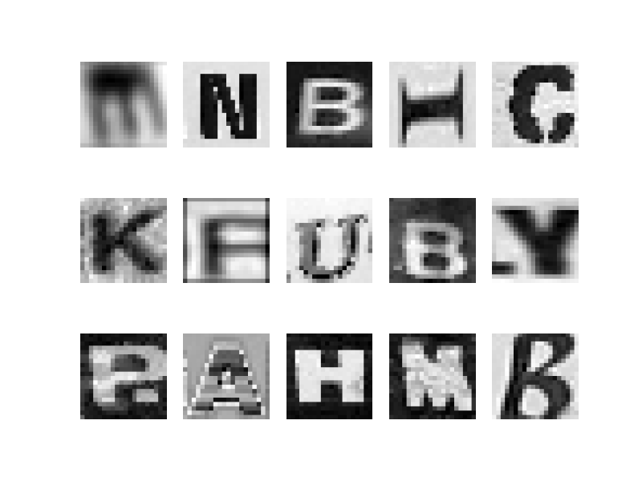  

## Model3  

#### Architecture 
- Conv2D 32 (2, 2) (1, 1) relu  
- MaxPooling2D (2, 2) (2, 2)  
- Conv2D 64 (2, 2) (1, 1) relu  
- MaxPooling2D (2, 2) (2, 2)  
- Flatten
- Dense 100 relu  
- Dense 26 softmax  

#### Training Plot 
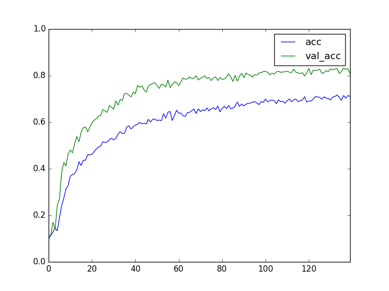  

#### Layer 1 Weights (Conv) - Sample Images 
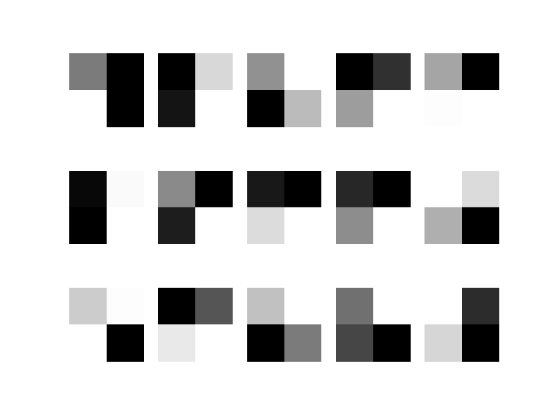  

#### Layer 3 Weights (Conv) - Sample Images 
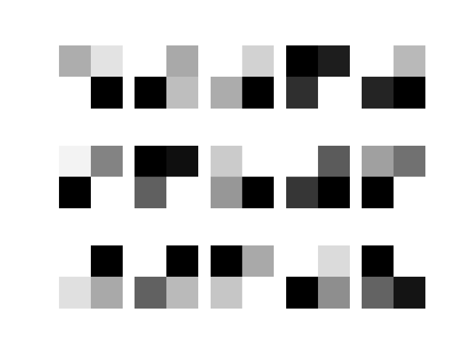  

#### Layer 6 Weights (Dense) - Sample Images 
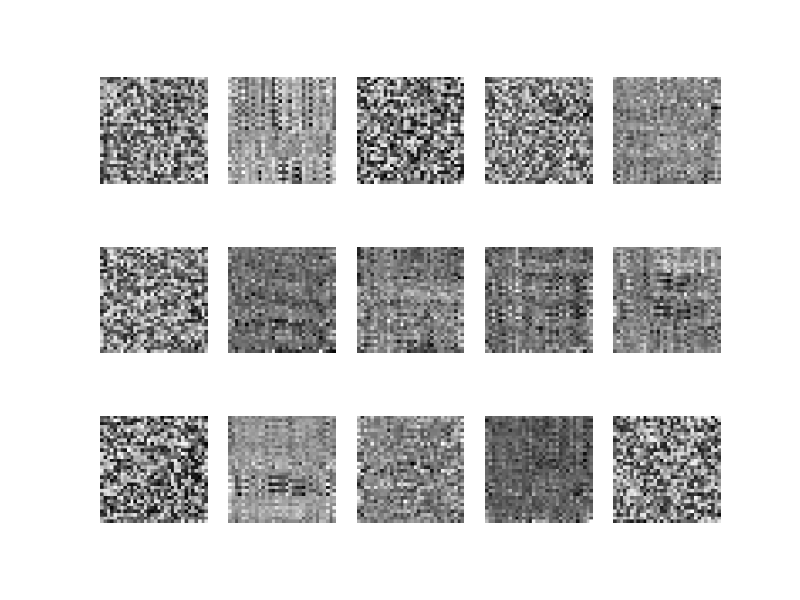  

#### Layer 7 Weights (Dense) - Sample Images 
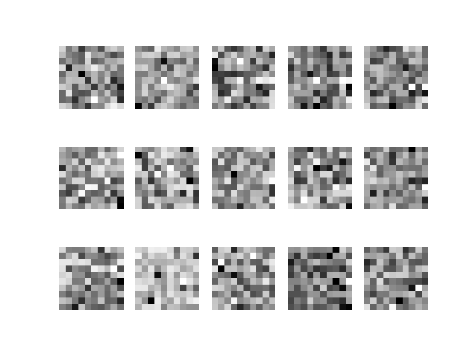  

#### Letter Accuracy 
<table border="1" class="dataframe">  <thead>    <tr style="text-align: right;">      <th></th>      <th>TrainCount</th>      <th>TrainCorrect</th>      <th>Train%Correct</th>      <th>ValCount</th>      <th>ValCorrect</th>      <th>Val%Correct</th>    </tr>    <tr>      <th>0</th>      <th></th>      <th></th>      <th></th>      <th></th>      <th></th>      <th></th>    </tr>  </thead>  <tbody>    <tr>      <th>A</th>      <td>275</td>      <td>256</td>      <td>0.93</td>      <td>92</td>      <td>81</td>      <td>0.88</td>    </tr>    <tr>      <th>B</th>      <td>54</td>      <td>29</td>      <td>0.54</td>      <td>18</td>      <td>7</td>      <td>0.39</td>    </tr>    <tr>      <th>C</th>      <td>102</td>      <td>91</td>      <td>0.89</td>      <td>34</td>      <td>29</td>      <td>0.85</td>    </tr>    <tr>      <th>D</th>      <td>99</td>      <td>86</td>      <td>0.87</td>      <td>33</td>      <td>28</td>      <td>0.85</td>    </tr>    <tr>      <th>E</th>      <td>214</td>      <td>202</td>      <td>0.94</td>      <td>71</td>      <td>62</td>      <td>0.87</td>    </tr>    <tr>      <th>F</th>      <td>41</td>      <td>31</td>      <td>0.76</td>      <td>14</td>      <td>8</td>      <td>0.57</td>    </tr>    <tr>      <th>G</th>      <td>66</td>      <td>57</td>      <td>0.86</td>      <td>22</td>      <td>18</td>      <td>0.82</td>    </tr>    <tr>      <th>H</th>      <td>91</td>      <td>66</td>      <td>0.73</td>      <td>30</td>      <td>18</td>      <td>0.60</td>    </tr>    <tr>      <th>I</th>      <td>162</td>      <td>142</td>      <td>0.88</td>      <td>54</td>      <td>45</td>      <td>0.83</td>    </tr>    <tr>      <th>J</th>      <td>31</td>      <td>25</td>      <td>0.81</td>      <td>10</td>      <td>2</td>      <td>0.20</td>    </tr>    <tr>      <th>K</th>      <td>40</td>      <td>39</td>      <td>0.98</td>      <td>13</td>      <td>9</td>      <td>0.69</td>    </tr>    <tr>      <th>L</th>      <td>100</td>      <td>94</td>      <td>0.94</td>      <td>34</td>      <td>30</td>      <td>0.88</td>    </tr>    <tr>      <th>M</th>      <td>76</td>      <td>67</td>      <td>0.88</td>      <td>25</td>      <td>22</td>      <td>0.88</td>    </tr>    <tr>      <th>N</th>      <td>167</td>      <td>161</td>      <td>0.96</td>      <td>56</td>      <td>49</td>      <td>0.88</td>    </tr>    <tr>      <th>O</th>      <td>174</td>      <td>161</td>      <td>0.93</td>      <td>58</td>      <td>54</td>      <td>0.93</td>    </tr>    <tr>      <th>P</th>      <td>78</td>      <td>64</td>      <td>0.82</td>      <td>26</td>      <td>16</td>      <td>0.62</td>    </tr>    <tr>      <th>Q</th>      <td>12</td>      <td>6</td>      <td>0.50</td>      <td>4</td>      <td>0</td>      <td>0.00</td>    </tr>    <tr>      <th>R</th>      <td>185</td>      <td>175</td>      <td>0.95</td>      <td>62</td>      <td>57</td>      <td>0.92</td>    </tr>    <tr>      <th>S</th>      <td>162</td>      <td>151</td>      <td>0.93</td>      <td>54</td>      <td>45</td>      <td>0.83</td>    </tr>    <tr>      <th>T</th>      <td>154</td>      <td>149</td>      <td>0.97</td>      <td>51</td>      <td>46</td>      <td>0.90</td>    </tr>    <tr>      <th>U</th>      <td>49</td>      <td>35</td>      <td>0.71</td>      <td>17</td>      <td>11</td>      <td>0.65</td>    </tr>    <tr>      <th>V</th>      <td>38</td>      <td>31</td>      <td>0.82</td>      <td>13</td>      <td>7</td>      <td>0.54</td>    </tr>    <tr>      <th>W</th>      <td>34</td>      <td>31</td>      <td>0.91</td>      <td>11</td>      <td>6</td>      <td>0.55</td>    </tr>    <tr>      <th>X</th>      <td>25</td>      <td>22</td>      <td>0.88</td>      <td>9</td>      <td>9</td>      <td>1.00</td>    </tr>    <tr>      <th>Y</th>      <td>32</td>      <td>24</td>      <td>0.75</td>      <td>11</td>      <td>7</td>      <td>0.64</td>    </tr>    <tr>      <th>Z</th>      <td>18</td>      <td>16</td>      <td>0.89</td>      <td>6</td>      <td>4</td>      <td>0.67</td>    </tr>  </tbody></table>  

#### Accurate Validation Prediction - Sample Images 
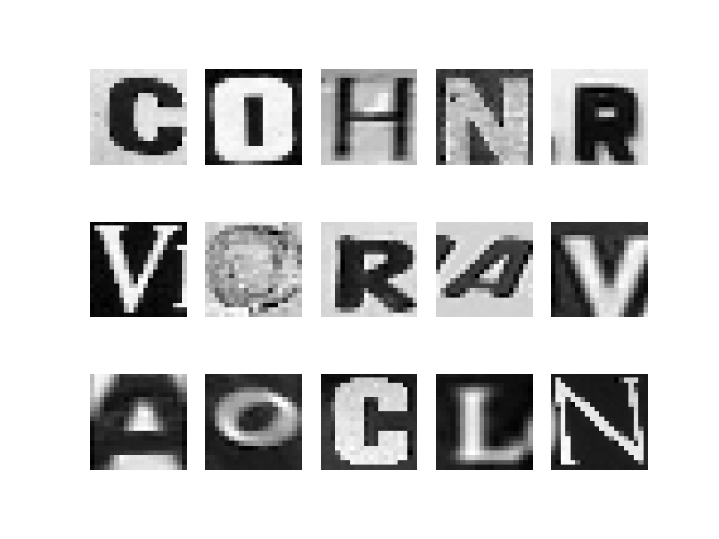  

#### Inaccurate Validation Prediction - Sample Images 
  

## Model4  

#### Architecture 
- Conv2D 32 (2, 2) (1, 1) relu  
- Conv2D 32 (2, 2) (1, 1) relu  
- MaxPooling2D (2, 2) (2, 2)  
- Conv2D 64 (2, 2) (1, 1) relu  
- Conv2D 64 (2, 2) (1, 1) relu  
- MaxPooling2D (2, 2) (2, 2)  
- Flatten
- Dense 100 relu  
- Dense 26 softmax  

#### Training Plot 
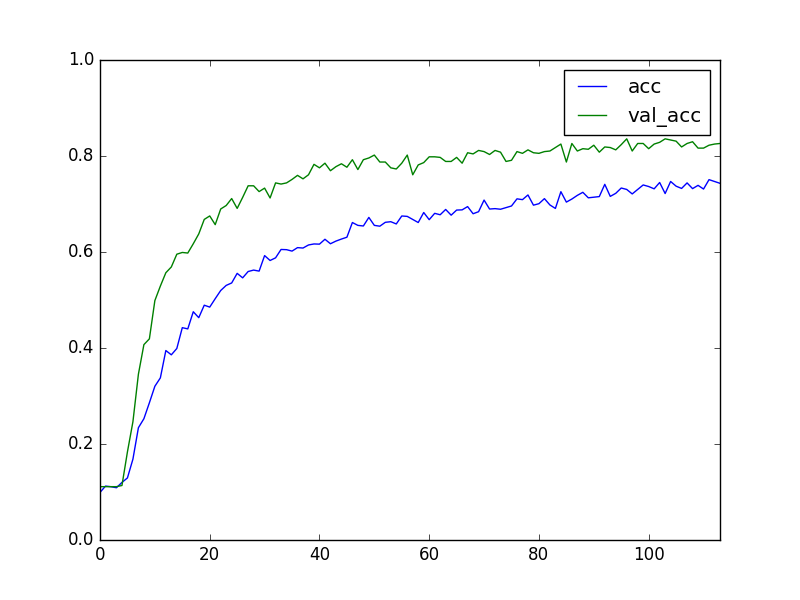  

#### Layer 1 Weights (Conv) - Sample Images 
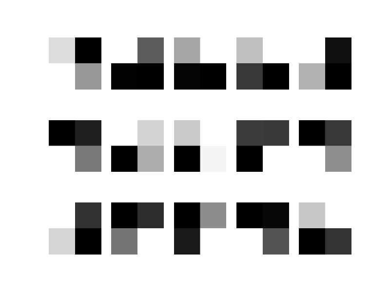  

#### Layer 2 Weights (Conv) - Sample Images 
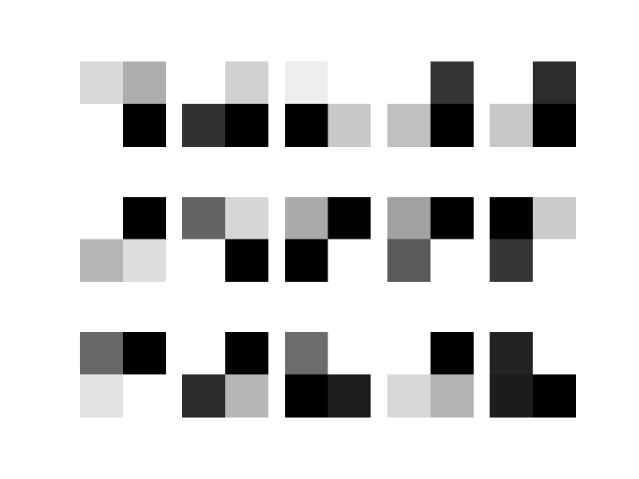  

#### Layer 4 Weights (Conv) - Sample Images 
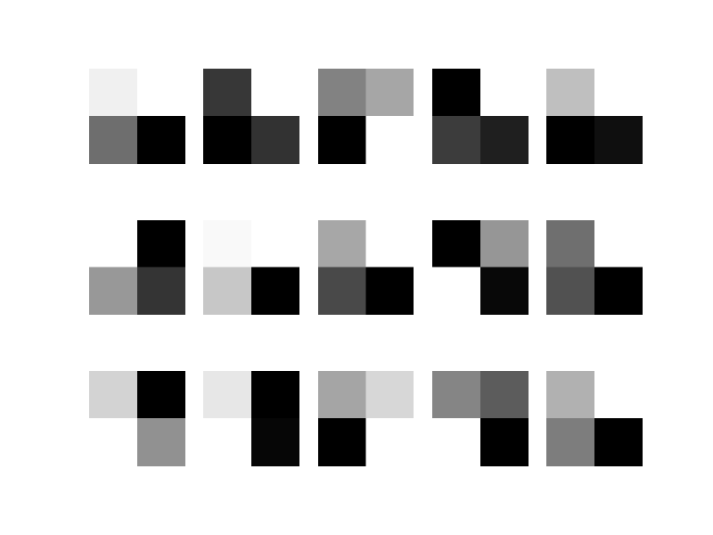  

#### Layer 5 Weights (Conv) - Sample Images 
  

#### Layer 8 Weights (Dense) - Sample Images 
  

#### Layer 9 Weights (Dense) - Sample Images 
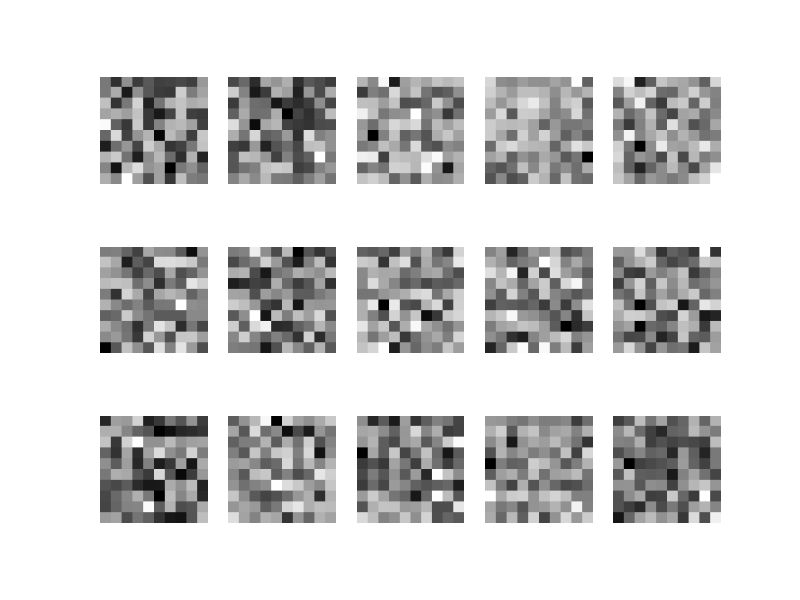  

#### Letter Accuracy 
<table border="1" class="dataframe">  <thead>    <tr style="text-align: right;">      <th></th>      <th>TrainCount</th>      <th>TrainCorrect</th>      <th>Train%Correct</th>      <th>ValCount</th>      <th>ValCorrect</th>      <th>Val%Correct</th>    </tr>    <tr>      <th>0</th>      <th></th>      <th></th>      <th></th>      <th></th>      <th></th>      <th></th>    </tr>  </thead>  <tbody>    <tr>      <th>A</th>      <td>275</td>      <td>253</td>      <td>0.92</td>      <td>92</td>      <td>83</td>      <td>0.90</td>    </tr>    <tr>      <th>B</th>      <td>54</td>      <td>43</td>      <td>0.80</td>      <td>18</td>      <td>11</td>      <td>0.61</td>    </tr>    <tr>      <th>C</th>      <td>102</td>      <td>90</td>      <td>0.88</td>      <td>34</td>      <td>30</td>      <td>0.88</td>    </tr>    <tr>      <th>D</th>      <td>99</td>      <td>90</td>      <td>0.91</td>      <td>33</td>      <td>30</td>      <td>0.91</td>    </tr>    <tr>      <th>E</th>      <td>214</td>      <td>203</td>      <td>0.95</td>      <td>71</td>      <td>61</td>      <td>0.86</td>    </tr>    <tr>      <th>F</th>      <td>41</td>      <td>22</td>      <td>0.54</td>      <td>14</td>      <td>5</td>      <td>0.36</td>    </tr>    <tr>      <th>G</th>      <td>66</td>      <td>60</td>      <td>0.91</td>      <td>22</td>      <td>17</td>      <td>0.77</td>    </tr>    <tr>      <th>H</th>      <td>91</td>      <td>80</td>      <td>0.88</td>      <td>30</td>      <td>23</td>      <td>0.77</td>    </tr>    <tr>      <th>I</th>      <td>162</td>      <td>145</td>      <td>0.90</td>      <td>54</td>      <td>45</td>      <td>0.83</td>    </tr>    <tr>      <th>J</th>      <td>31</td>      <td>21</td>      <td>0.68</td>      <td>10</td>      <td>2</td>      <td>0.20</td>    </tr>    <tr>      <th>K</th>      <td>40</td>      <td>38</td>      <td>0.95</td>      <td>13</td>      <td>9</td>      <td>0.69</td>    </tr>    <tr>      <th>L</th>      <td>100</td>      <td>91</td>      <td>0.91</td>      <td>34</td>      <td>30</td>      <td>0.88</td>    </tr>    <tr>      <th>M</th>      <td>76</td>      <td>70</td>      <td>0.92</td>      <td>25</td>      <td>23</td>      <td>0.92</td>    </tr>    <tr>      <th>N</th>      <td>167</td>      <td>160</td>      <td>0.96</td>      <td>56</td>      <td>47</td>      <td>0.84</td>    </tr>    <tr>      <th>O</th>      <td>174</td>      <td>151</td>      <td>0.87</td>      <td>58</td>      <td>49</td>      <td>0.84</td>    </tr>    <tr>      <th>P</th>      <td>78</td>      <td>67</td>      <td>0.86</td>      <td>26</td>      <td>19</td>      <td>0.73</td>    </tr>    <tr>      <th>Q</th>      <td>12</td>      <td>6</td>      <td>0.50</td>      <td>4</td>      <td>1</td>      <td>0.25</td>    </tr>    <tr>      <th>R</th>      <td>185</td>      <td>172</td>      <td>0.93</td>      <td>62</td>      <td>56</td>      <td>0.90</td>    </tr>    <tr>      <th>S</th>      <td>162</td>      <td>154</td>      <td>0.95</td>      <td>54</td>      <td>47</td>      <td>0.87</td>    </tr>    <tr>      <th>T</th>      <td>154</td>      <td>150</td>      <td>0.97</td>      <td>51</td>      <td>46</td>      <td>0.90</td>    </tr>    <tr>      <th>U</th>      <td>49</td>      <td>36</td>      <td>0.73</td>      <td>17</td>      <td>12</td>      <td>0.71</td>    </tr>    <tr>      <th>V</th>      <td>38</td>      <td>30</td>      <td>0.79</td>      <td>13</td>      <td>7</td>      <td>0.54</td>    </tr>    <tr>      <th>W</th>      <td>34</td>      <td>33</td>      <td>0.97</td>      <td>11</td>      <td>10</td>      <td>0.91</td>    </tr>    <tr>      <th>X</th>      <td>25</td>      <td>25</td>      <td>1.00</td>      <td>9</td>      <td>8</td>      <td>0.89</td>    </tr>    <tr>      <th>Y</th>      <td>32</td>      <td>29</td>      <td>0.91</td>      <td>11</td>      <td>9</td>      <td>0.82</td>    </tr>    <tr>      <th>Z</th>      <td>18</td>      <td>18</td>      <td>1.00</td>      <td>6</td>      <td>4</td>      <td>0.67</td>    </tr>  </tbody></table>  

#### Accurate Validation Prediction - Sample Images 
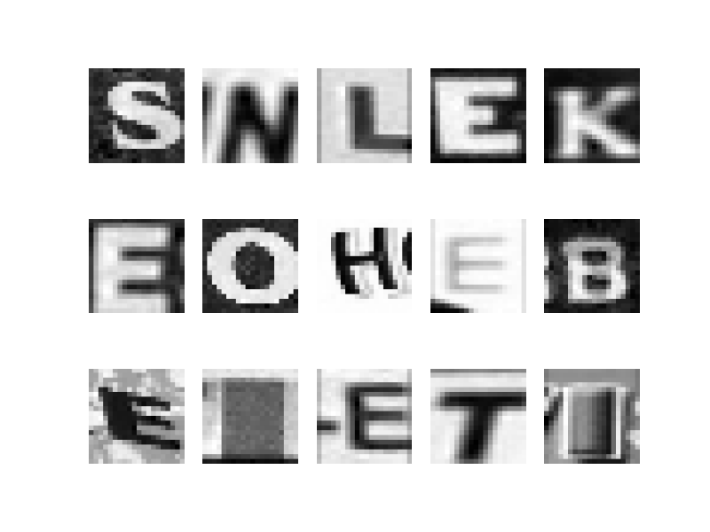  

#### Inaccurate Validation Prediction - Sample Images 

